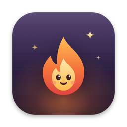
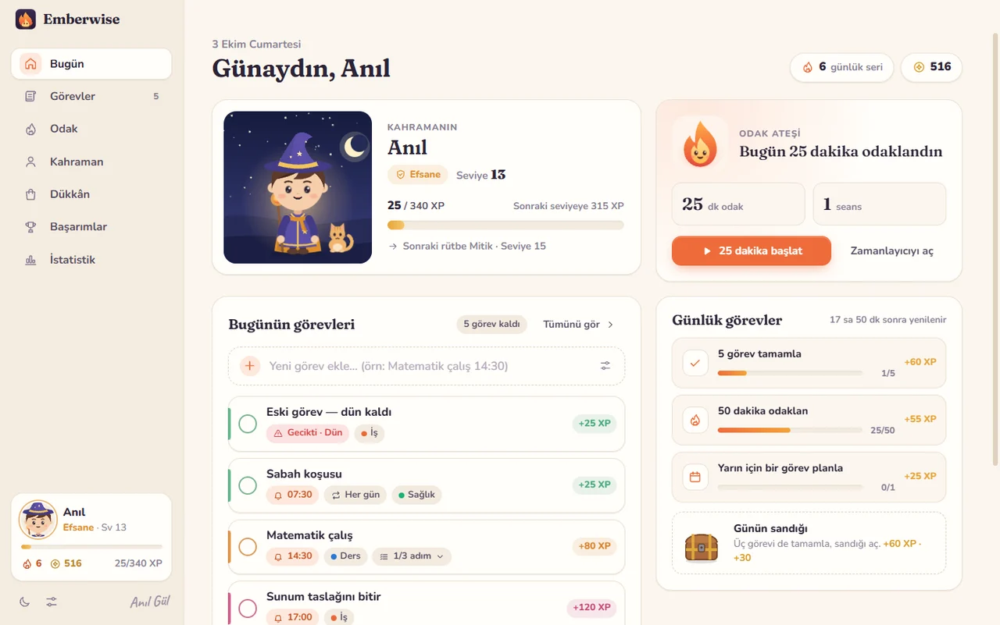
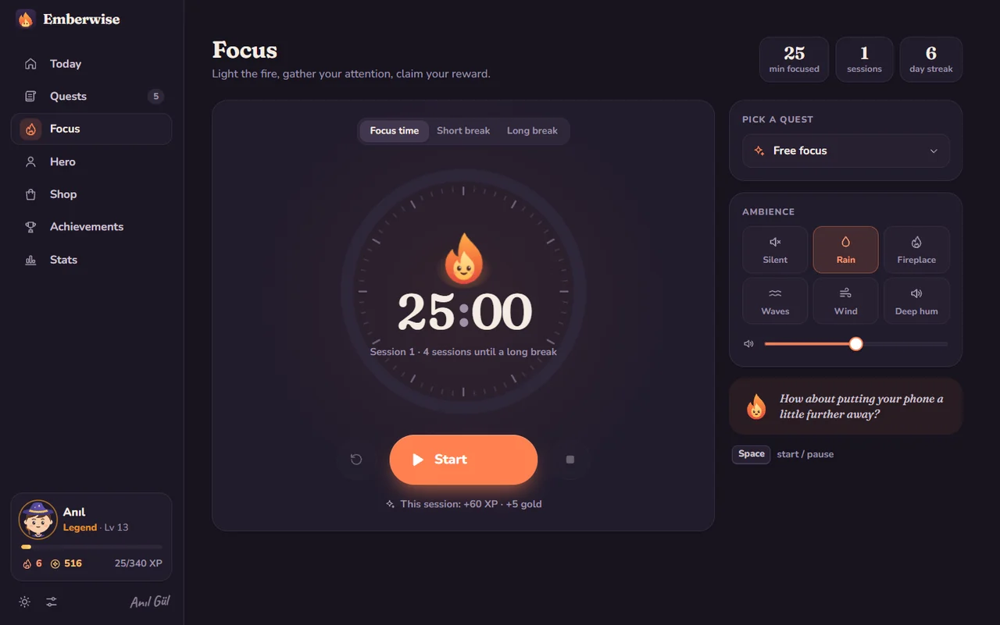
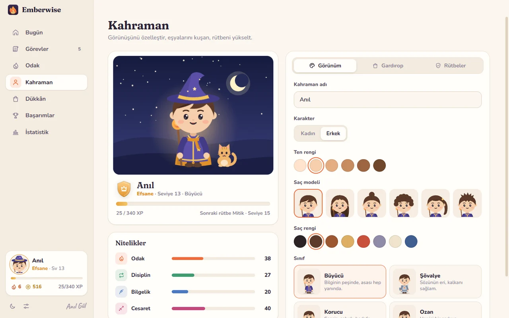
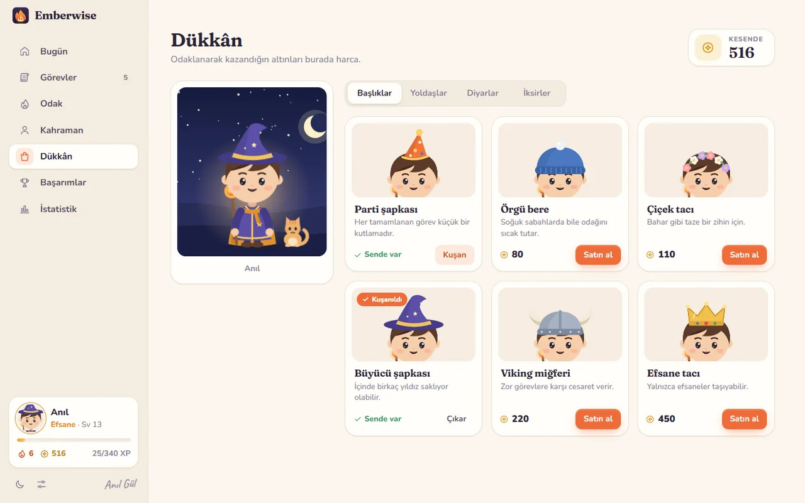
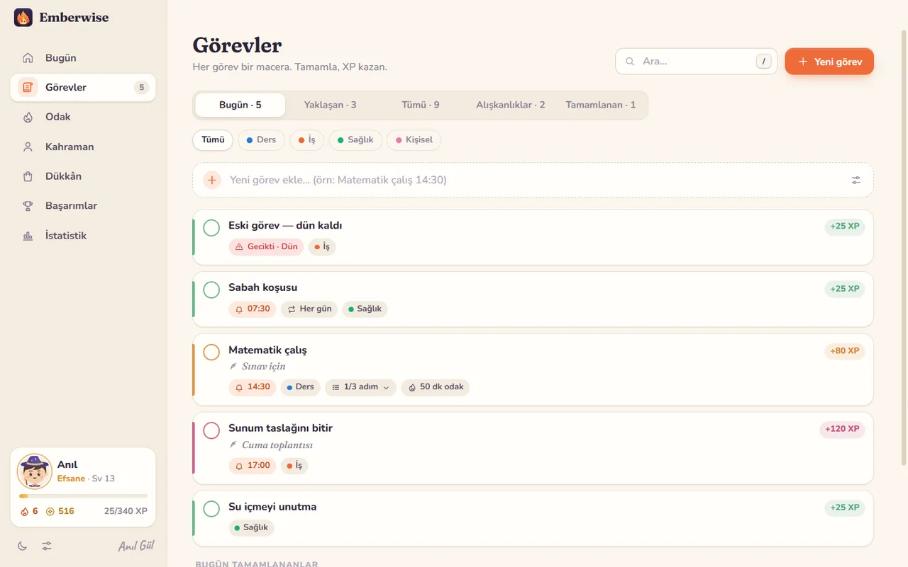
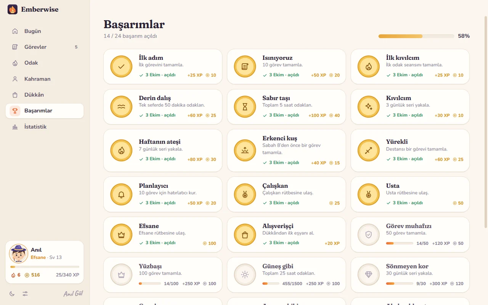
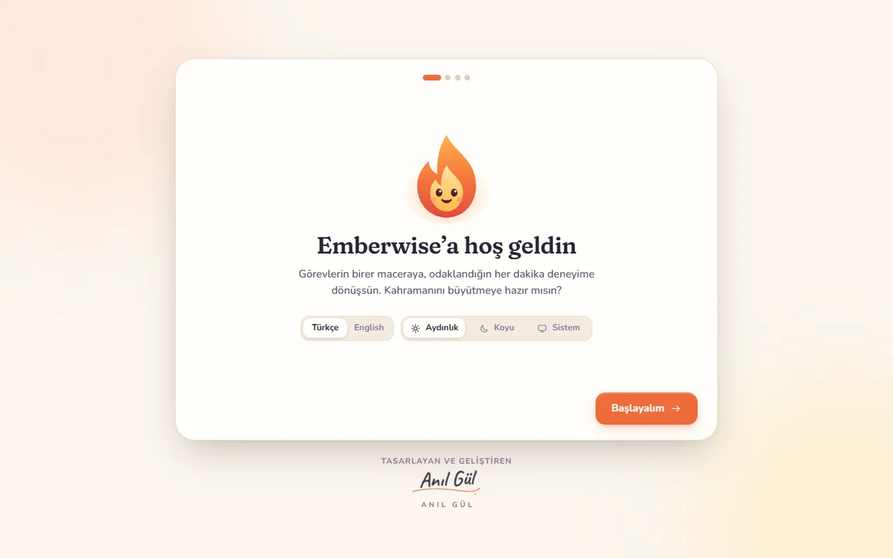
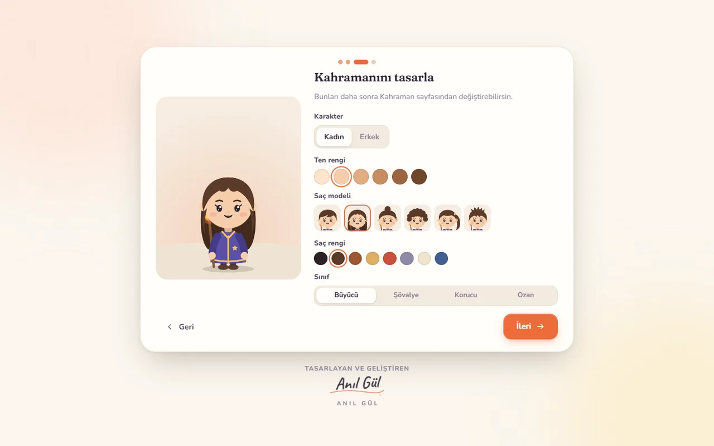

<p align="center">
  
</p>

<h1 align="center">Emberwise</h1>

<p align="center">
  <b>Odağını ateşle, kahramanını büyüt.</b><br />
  <i>Light your focus, grow your hero.</i>
</p>

<p align="center">
  Windows · macOS (Apple Silicon M1–M5 &amp; Intel) · 100% offline · Türkçe &amp; English · Light &amp; dark
</p>

<p align="center">
  
</p>

---

## 🇹🇷 Türkçe

**Emberwise**, görevlerini maceraya, odaklandığın her dakikayı deneyime dönüştüren sıcak, sevimli bir üretkenlik oyunudur. Görev eklersin, amacını yazarsın, hatırlatıcı kurarsın; tamamladıkça ve odaklandıkça XP ve altın kazanır, kahramanını büyütür, rütbe atlarsın.

Bu uygulama, JavaFX ile yazılmış **[Odak Menajeri RPG](https://github.com/anilg12/Odak-Menajeri-RPG)** projesinin baştan aşağı yeniden tasarlanmış, Windows ve macOS'ta çalışan hâlidir.

### İndir ve kur

En güncel sürüm: **[Releases](https://github.com/anilg12/Emberwise/releases/latest)**

| Platform | Dosya | Kurulum |
| --- | --- | --- |
| Windows 10 / 11 | `Emberwise-Setup-x.y.z.exe` | Çift tıkla, kendiliğinden kurulur ve açılır. Yönetici izni istemez. |
| macOS · Apple Silicon (M1–M5 ve sonrası) | `Emberwise-x.y.z-mac-arm64.dmg` | Aç, Emberwise'ı **Uygulamalar** klasörüne sürükle. |
| macOS · Intel | `Emberwise-x.y.z-mac-x64.dmg` | Aynı şekilde. |

> **Windows SmartScreen:** Uygulama henüz ücretli bir kod imzalama sertifikasıyla imzalanmadığı için, internetten indirilen kurulum dosyasında "Windows bilgisayarınızı korudu" uyarısı çıkabilir. **Ek bilgi → Yine de çalıştır** demen yeterli.
>
> **macOS:** Uygulama Apple tarafından noter onaylı (notarized) değil. İlk açılışta Emberwise'a **sağ tık → Aç** de ya da **Sistem Ayarları → Gizlilik ve Güvenlik → Yine de Aç**'ı kullan. Gerekirse Terminal'de: `xattr -dr com.apple.quarantine /Applications/Emberwise.app`

### Özellikler

**Orijinal Odak Menajeri RPG'deki her şey**
- 👤 Kadın / Erkek karakter seçimi — artık el çizimi, özelleştirilebilir bir kahraman
- 🧠 Görev tanımlama: görev adı, **amaç** ("Neden yapıyorsun?") ve hatırlatma saati
- 🔔 Belirlenen saatte bildirim; her hatırlatıcı yalnızca bir kez çalar
- ⚔️ Görevi tamamlayınca **+50 XP** (zorluğa göre 25 – 120 XP)
- ✅ Görev tamamlama ve silme (geri alma desteğiyle)
- 🧱 Seviye ve rütbe: **Acemi → Çalışkan → Usta → Efsane** (+ Mitik ve Ölümsüz)
- 📊 Bir sonraki seviyeye kalan XP'yi gösteren ilerleme çubuğu
- 🌙 Karanlık tema — artık aydınlık ve sisteme göre tema da var

**Yeni gelenler**
- 🔥 **Odak zamanlayıcısı** (Pomodoro): odak / kısa mola / uzun mola, görev bağlama, otomatik geçişler, sistem tepsisinde ve görev çubuğunda kalan süre
- 🌧️ **Ortam sesleri**: yağmur, şömine, dalgalar, rüzgâr, derin uğultu — hepsi çevrimdışı, gerçek zamanlı sentezlenir
- 📜 Gelişmiş görevler: zorluk, kategori, tarih, **tekrarlayan görevler** (her gün / hafta içi / belirli günler), adımlar (alt görevler), arama ve filtreler
- ⚡ Hızlı ekleme: `Matematik çalış 14:30` yaz, hatırlatıcı kendiliğinden kurulsun; `yarın` yazarsan yarına eklenir
- 🎯 **Günlük görevler** ve **günün sandığı**
- 🔥 Günlük seri ve seriyi koruyan **Kor kalkanı**
- 🛍️ **Dükkân**: şapkalar, yoldaşlar (kedi, baykuş, tilki, kor ruhu, yavru ejder…) ve diyarlar (yıldızlı gece, kütüphane, kamp ateşi, sakura, kutup ışıkları…)
- 🏆 24 **başarım**, seviye atlama kutlamaları ve konfeti
- 📈 **İstatistikler**: odak grafiği, etkinlik haritası, kategori dağılımı, macera günlüğü
- 🧙 Kahraman nitelikleri: Odak, Disiplin, Bilgelik, Cesaret
- 🎨 6 vurgu rengi, animasyon tercihi (azaltılmış hareket desteği)
- 🌍 Türkçe ve İngilizce, ilk açılışta sistem diline göre otomatik
- 💾 Yedek al / yedekten yükle, veriler yalnızca senin bilgisayarında
- ⌨️ Klavye kısayolları (`Ctrl/⌘+N`, `Ctrl/⌘+1…7`, `Boşluk`, `/`)
- 🖥️ Sistem tepsisi / menü çubuğu, bilgisayar açılınca başlatma, "üstte tut" modu

### Gizlilik

Emberwise **hiçbir zaman internete bağlanmaz**. Hesap yok, reklam yok, takip yok. Tüm verilerin tek bir dosyada, bilgisayarında saklanır:
- Windows: `%APPDATA%\Emberwise\emberwise-data.json`
- macOS: `~/Library/Application Support/Emberwise/emberwise-data.json`

---

## 🇬🇧 English

**Emberwise** is a cozy productivity game that turns your tasks into quests and every focused minute into experience. Add quests, write down *why* they matter, set reminders — then complete them and focus to earn XP and gold, grow your hero and climb the ranks.

It is a ground-up redesign of the JavaFX project **[Odak Menajeri RPG](https://github.com/anilg12/Odak-Menajeri-RPG)**, rebuilt for Windows and macOS.

### Download

Grab the latest build from **[Releases](https://github.com/anilg12/Emberwise/releases/latest)**: the `.exe` for Windows, the `mac-arm64.dmg` for Apple Silicon (M1–M5 and newer) or `mac-x64.dmg` for Intel Macs.

> The builds are not code-signed with a paid certificate yet. On Windows choose **More info → Run anyway** if SmartScreen appears. On macOS right-click the app → **Open** the first time (or System Settings → Privacy & Security → **Open Anyway**).

### Highlights

- Quests with purpose, difficulty, categories, dates, repeating schedules, steps and one-time reminders
- Pomodoro focus timer with procedural ambient sounds, tray/menu-bar countdown and taskbar progress
- XP, gold, levels and the original ranks — **Novice → Diligent → Master → Legend** — plus Mythic and Immortal
- Daily quests, a daily chest, streaks with ember shields, 24 achievements
- A hand-drawn hero you can dress up, companions and realms from the shop
- Stats: focus chart, activity heatmap, quests by category, adventure log
- Light, dark and system themes, six accent colors, reduced-motion support
- Turkish and English, fully offline, data stays on your machine

<p align="center">
  
  
  
  
  
  
  
  
</p>

---

## Development

Requirements: **Node.js 22+** (24 recommended).

```bash
npm install
npm run dev        # UI in the browser (http://localhost:5173)
npm start          # build and run the desktop app
npm test           # unit tests (game rules, dates, reminders, streaks, shop…)
npm run e2e        # end-to-end smoke test in the real Electron window
npm run check      # type check
```

Build installers:

```bash
npm run dist:win   # release/Emberwise-Setup-x.y.z.exe   (run on Windows)
npm run dist:mac   # release/Emberwise-x.y.z-mac-*.dmg    (run on macOS)
```

Pushing a tag such as `v1.0.1` runs the GitHub Actions workflow, which builds Windows and macOS (arm64 + x64) installers and publishes them on the Releases page.

### Stack

Electron · Svelte 5 · TypeScript · Vite. No runtime dependencies, no network access. Icons, the hero, companions, realms and the Ember mascot are hand-drawn SVG; every sound is synthesized with the Web Audio API.

```
electron/          main process, preload bridge, tray assets
src/lib/           game rules, store, timer, i18n, sounds, ambience
src/components/    UI building blocks, hero & item art
src/views/         Today, Quests, Focus, Hero, Shop, Achievements, Stats, Settings, Onboarding
scripts/           icon generator, screenshot harness, e2e test
tests/             unit tests
```

---

<p align="center">
  Tasarlayan ve geliştiren · Designed &amp; built by<br />
  <b>ANIL GÜL</b><br />
  <a href="https://www.linkedin.com/in/an%C4%B1l-g%C3%BCl-753417249">LinkedIn</a>
</p>

<p align="center"><sub>MIT License © 2026 Anıl Gül</sub></p>
