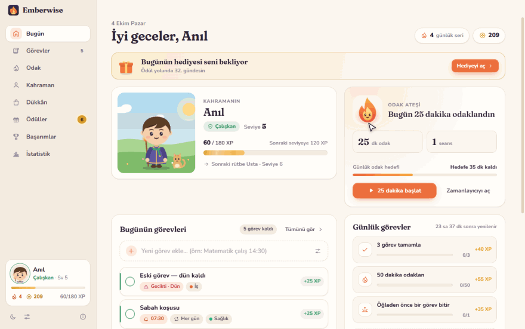
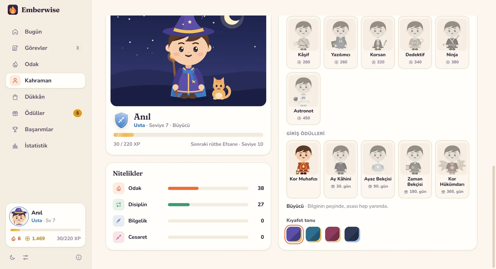
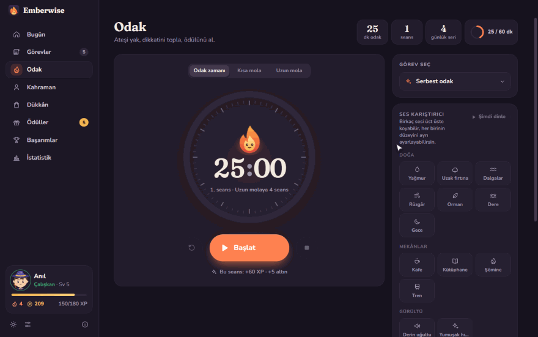
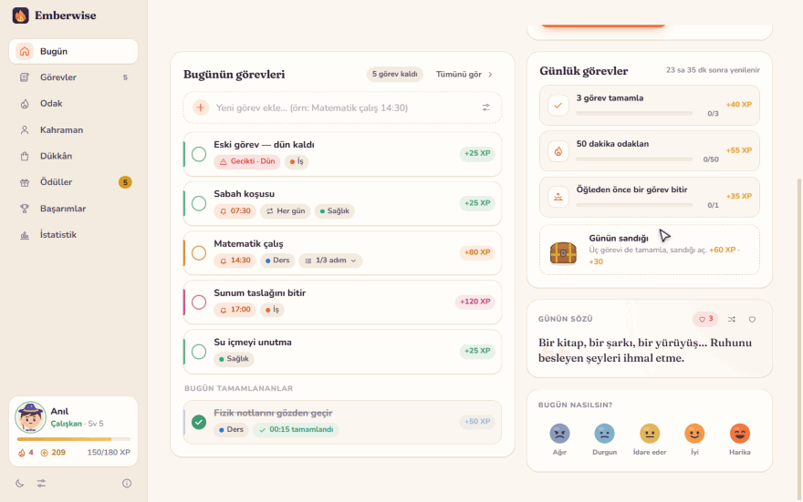
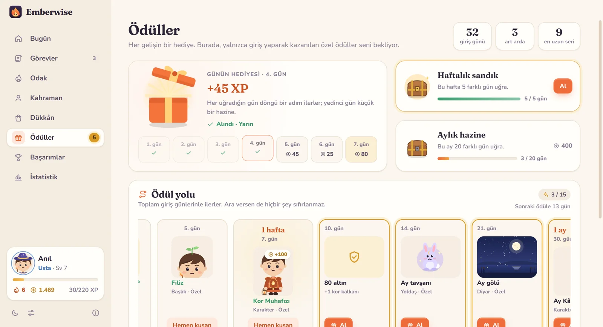
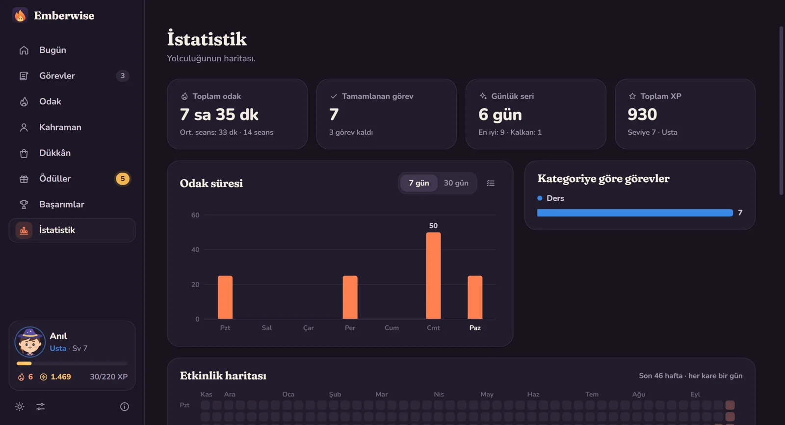

<div align="center">

<picture>
  <source media="(prefers-color-scheme: dark)" srcset="docs/media/banner-dark.svg">
  
</picture>

<br>
<br>

<a href="https://github.com/anilg12/Emberwise/releases/latest/download/Emberwise-Setup.exe"></a>&nbsp;
<a href="https://github.com/anilg12/Emberwise/releases/latest/download/Emberwise-mac-arm64.dmg"></a>&nbsp;
<a href="https://github.com/anilg12/Emberwise/releases/latest/download/Emberwise-mac-x64.dmg"></a>

<sub>Sürüm 1.1 · Ücretsiz · Hesap yok, reklam yok · İnternet bağlantısı gerekmez · <a href="#english">English</a></sub>

</div>

<br>

**Emberwise**, görevlerini maceraya, odaklandığın her dakikayı deneyime çeviren sıcak bir odak oyunu. Görev ekler, amacını yazar, hatırlatıcı kurarsın; bitirdikçe ve odaklandıkça XP ve altın kazanır, kahramanını büyütür, rütbe atlarsın. Her gün uğradıkça yalnızca girişle kazanılan özel karakterlerin kilidini açarsın.

JavaFX ile yazdığım **[Odak Menajeri RPG](https://github.com/anilg12/Odak-Menajeri-RPG)**'nin baştan aşağı yeniden yazılmış, Windows ve Mac'te çalışan hâli.

> **1.1'de neler var?** Günlük, haftalık, aylık ve bir yıla uzanan **giriş ödülleri** · **19 karakter**, her biri 4 kıyafet tonuyla, artı aksesuarlar · gerçek kayıtlardan **13 ortam sesi** ve ses karıştırıcı · hayata, anlama ve mutluluğa dair **400'e yakın söz** · ruh hâli günlüğü, nefes egzersizi, günlük odak hedefi.

<br>

<p align="center">
  
</p>

## Görev ekle, bitir, seviye atla

Göreve bir ad ve bir amaç yaz (*"Neden yapıyorsun?"*), istersen saat kur. Acelen varsa kutuya `Matematik çalış 14:30` yazıp Enter'a basman yeter: saat de hatırlatıcı da kendiliğinden ayarlanır, sonuna `yarın` eklersen yarına düşer.

Bitirdiğin her görev zorluğuna göre **25 ile 120 XP** arası ve biraz altın getirir. Seviye atladığında küçük bir kutlama, rütbe atladığında yeni unvanın seni bekler. Tekrarlayan görevler, alt adımlar, kategoriler ve arama da var.

## Her gün bir hediye, bir yıl boyunca bir yol

<p align="center">
  
</p>

Emberwise'ı açtığın her gün bir **hediye kutusu** seni bekler; yedi günlük döngünün son günü küçük bir hazinedir. Bir haftada 5 gün uğrarsan **haftalık sandık**, bir ayda 20 gün uğrarsan **aylık hazine** açılır.

Asıl sürpriz **Ödül yolu**nda: 2. günden 365. güne kadar uzanan bu yolda, dükkânda satılmayan **15 özel parça** var. Kor Muhafızı (1 hafta), Ay Kâhini (1 ay), Ayaz Bekçisi (3 ay), Zaman Bekçisi (6 ay) ve kanatlı **Kor Hükümdarı** (1 yıl) gibi karakterler; Ay tavşanı, Yıldız balinası, Anka yavrusu gibi yoldaşlar; Ay gölü, Kristal mağara ve Göksel diyar gibi diyarlar. Yol toplam giriş günüyle ilerler: ara versen bile hiçbir şey sıfırlanmaz.

## 19 karakter, kıyafetler ve aksesuarlar

<p align="center">
  
</p>

Büyücü, Şövalye, Korucu ve Ozan'ın yanına artık Bilim insanı, Aşçı, Bahçıvan ve Ressam da geldi; dükkânda Kâşif, Yazılımcı, Korsan, Dedektif, Ninja ve Astronot var. Her karakterin kendine özgü kıyafeti, elinde taşıdığı eşyası ve **dört kıyafet tonu** var. Gözlük, kulaklık, papyon, küpe, sırt çantası gibi **aksesuarlar** ve yeni başlıklar her karaktere tam oturacak şekilde elle çizildi.

<p align="center">
  
</p>

## Odak ateşi ve ortam sesleri

<p align="center">
  
</p>

Pomodoro zamanlayıcısını başlat, kor ruhu sen odaklandıkça büyüsün. Seans bitince XP ve altın kazanır, kısa bir molaya geçersin. Günlük odak hedefin Bugün sayfasında ve zamanlayıcıda halka olarak görünür. Kalan süre sistem tepsisinde ve görev çubuğunda da durur.

<p align="center">
  
</p>

**Ses karıştırıcı** ile yağmur, uzak fırtına, dalgalar, rüzgâr, orman, dere, gece, kafe, kütüphane, şömine ve tren seslerini istediğin gibi üst üste koyabilir, her birinin düzeyini ayrı ayarlayabilirsin. "Yağmurlu kafe", "Kamp gecesi", "Gece treni" gibi hazır karışımlar da var. Bu sesler Wikimedia Commons'taki özgür lisanslı gerçek saha kayıtlarından seçildi; sakin kalsınlar diye yumuşatıldı ve kesintisiz döngüye çevrildi. Molalarda bir **nefes egzersizi** de seni bekliyor.

## Her gün duymaya değer sözler

<p align="center">
  
</p>

Görev bitirdiğinde, odak seansı tamamlandığında, seviye atladığında ya da sabah uygulamayı açtığında kor ruhu sana kısacık bir söz fısıldar. Bu **400'e yakın söz** sadece çalışmayla ilgili değil: hayata, anlama, iyiliğe ve küçük mutluluklara dair. Hepsi Emberwise için yazıldı. Beğendiklerini kalple saklayabilirsin. Bugün sayfasında **günün sözü** ve *"Bugün nasılsın?"* kartı var; ruh hâlini işaretleyip minnettar olduğun bir şeyi not edebilirsin, İstatistik'te son 30 günün haritası çıkar.

## Dükkân, yoldaşlar ve diyarlar

<p align="center">
  
</p>

Odaklanarak kazandığın altınla karakter, başlık, aksesuar, yoldaş ve diyar alırsın. Üzerine gelince kahramanın üstünde önizlenir. Seriyi koruyan *Kor kalkanı* da burada.

## Aydınlık mı, koyu mu?

<p align="center">
  
</p>

Aydınlık, koyu ya da sisteme göre. Altı vurgu rengi, Türkçe ve İngilizce arayüz, azaltılmış hareket seçeneği. İlk açılışta dil ve tema bilgisayarına göre kendiliğinden seçilir.

## Rütbeler

<picture>
  <source media="(prefers-color-scheme: dark)" srcset="docs/media/ranks-dark.svg">
  
</picture>

Orijinal dört rütbe aynen duruyor: **Acemi → Çalışkan → Usta → Efsane**. Gerçekten azimli olanlar için iki yenisi var: **Mitik** ve **Ölümsüz**. Bunların yanında günlük görevler ve günün sandığı, günlük seri, 29 başarım ve odak grafikleriyle bir istatistik sayfası da var.

## İlk açılış

<p align="center">
  
</p>

<p align="center">
  
  
</p>

## Kurulum

**Windows 10 / 11:** [`Emberwise-Setup.exe`](https://github.com/anilg12/Emberwise/releases/latest/download/Emberwise-Setup.exe) dosyasına çift tıkla. Yönetici izni istemez; kurulur, masaüstüne kısayol koyar ve kendiliğinden açılır. Önceki sürümün üzerine kurulur, verilerin olduğu gibi kalır. Windows "bilgisayarınızı korudu" uyarısı gösterirse **Ek bilgi → Yine de çalıştır** de (uygulama henüz ücretli bir sertifikayla imzalanmadı).

**macOS:** Apple Silicon (M1–M5 ve sonrası) için [`Emberwise-mac-arm64.dmg`](https://github.com/anilg12/Emberwise/releases/latest/download/Emberwise-mac-arm64.dmg), Intel için [`Emberwise-mac-x64.dmg`](https://github.com/anilg12/Emberwise/releases/latest/download/Emberwise-mac-x64.dmg). Dosyayı aç, Emberwise'ı **Uygulamalar** klasörüne sürükle. İlk açılışta uygulamaya **sağ tık → Aç** de ya da **Sistem Ayarları → Gizlilik ve Güvenlik → Yine de Aç**'ı kullan.

**Verilerin:** Emberwise internete hiç bağlanmaz. Her şey tek bir dosyada, senin bilgisayarında durur:
`%APPDATA%\Emberwise\emberwise-data.json` (Windows) · `~/Library/Application Support/Emberwise/emberwise-data.json` (macOS).
Ayarlar'dan yedek alıp geri yükleyebilirsin.

<br>

## English

**Emberwise** is a cozy focus game for Windows and macOS. Add quests and write down *why* they matter, set reminders, then complete them and focus to earn XP and gold, grow your hero and climb the ranks: **Novice → Diligent → Master → Legend → Mythic → Immortal**.

**New in 1.1**

- **Login rewards:** a daily gift on a seven-day cycle, a weekly chest, a monthly treasure and a reward path that runs a whole year. Along the way there are **15 exclusive pieces you can only earn by coming back**, including five characters such as the winged *Ember Sovereign* on day 365. Taking a break never resets your progress.
- **19 characters** (wizard, knight, ranger, bard, scientist, chef, gardener, painter, explorer, coder, pirate, detective, ninja, astronaut and five login-only heroes), each with **four outfit tones**, plus accessories (glasses, headphones, bow tie, earrings, backpack…), new hats, companions and realms, all hand-drawn to fit every character.
- **Ambience mixer:** 11 real field recordings from Wikimedia Commons (rain, distant storm, waves, wind, forest, stream, night, café, library, fireplace, train), softened and seamlessly looped, plus two soft noises. Layer them freely or pick a blend such as *Rainy café* or *Night train*.
- **Words for the road:** close to 400 original lines in Turkish and English about life, meaning, kindness and small joys, not just work. They're personalised and fit the moment, with a line of the day and a place to keep your favourites.
- A mood and gratitude journal, a breathing exercise for breaks, a daily focus goal and five new achievements.

Also included:

- Quests with a purpose, difficulty, categories, dates, repeating schedules, steps and one-time reminders
- Quick add: type `Study math 14:30 tomorrow` and the reminder sets itself
- Pomodoro focus timer that shows up in the tray and the taskbar
- Daily quests and a daily chest, streaks with ember shields, 29 achievements, stats
- Light, dark and system themes, six accent colours, Turkish and English
- Fully offline: no account, no ads, no tracking; your data stays on your computer

**Download:** [Windows](https://github.com/anilg12/Emberwise/releases/latest/download/Emberwise-Setup.exe) · [macOS Apple Silicon](https://github.com/anilg12/Emberwise/releases/latest/download/Emberwise-mac-arm64.dmg) · [macOS Intel](https://github.com/anilg12/Emberwise/releases/latest/download/Emberwise-mac-x64.dmg). The builds are not signed with a paid certificate yet: on Windows choose **More info → Run anyway** if SmartScreen appears; on macOS right-click the app and choose **Open** the first time. Installing over an older version keeps your data.

## Development

Requirements: **Node.js 22+** (24 recommended).

```bash
npm install
npm run dev        # UI in the browser (http://localhost:5173)
npm start          # build and run the desktop app
npm test           # unit tests (game rules, rewards, characters, ambience, words…)
npm run e2e        # end-to-end test in the real Electron window
npm run check      # type check
```

Installers:

```bash
npm run dist:win   # release/Emberwise-Setup.exe        (on Windows)
npm run dist:mac   # release/Emberwise-mac-*.dmg        (on macOS)
```

Pushing a tag such as `v1.1.0` runs the GitHub Actions workflow, which builds the Windows and macOS (arm64 + x64) installers and publishes them on the Releases page.

Assets and tooling:

- `node scripts/make-ambience.mjs` rebuilds the ambience loops in `public/ambience` from the Wikimedia Commons recordings (needs ffmpeg). Credits are in [`public/ambience/CREDITS.md`](public/ambience/CREDITS.md) and in the app's About window.
- `npx electron scripts/record.cjs --scene=rewards` records the README GIFs from the real app (scenes: `quest`, `rewards`, `hero`, `focus`, `sounds`, `words`, `shop`, `theme`, `onboarding`).
- `node scripts/make-readme-art.mjs` draws the animated SVGs; in `npm run dev`, `/#gallery` shows every outfit, accessory, companion and realm side by side.

**Stack:** Electron · Svelte 5 · TypeScript · Vite. No runtime dependencies and no network access. Icons, characters, companions, realms and the Ember mascot are hand-drawn SVG; effect sounds are synthesized with the Web Audio API.

```
electron/          main process, preload bridge, tray assets
public/ambience/   looped field recordings and their credits
src/lib/           game rules, store, rewards, characters, words, timer, i18n, sound, ambience
src/components/    UI building blocks, hero, outfit & item art
src/views/         Today, Quests, Focus, Hero, Shop, Rewards, Achievements, Stats, Settings, Onboarding
scripts/           icons, ambience, README art, demo recorder, screenshots, e2e test
tests/             unit tests
```

<br>

<div align="center">

<picture>
  <source media="(prefers-color-scheme: dark)" srcset="docs/media/signature-dark.svg">
  
</picture>

[LinkedIn](https://www.linkedin.com/in/an%C4%B1l-g%C3%BCl-753417249) · [Odak Menajeri RPG](https://github.com/anilg12/Odak-Menajeri-RPG) · [GitHub](https://github.com/anilg12)

<sub>MIT License © 2026 Anıl Gül · Ambience recordings keep their own licenses (see CREDITS)</sub>

</div>
