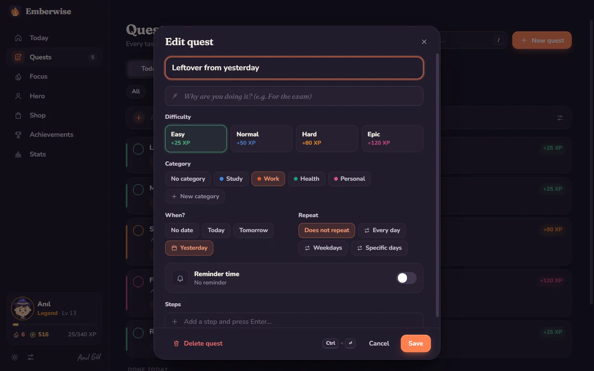

<div align="center">

<picture>
  <source media="(prefers-color-scheme: dark)" srcset="docs/media/banner-dark.svg">
  
</picture>

<br>
<br>

<a href="https://github.com/anilg12/Emberwise/releases/latest/download/Emberwise-Setup.exe"></a>&nbsp;
<a href="https://github.com/anilg12/Emberwise/releases/latest/download/Emberwise-mac-arm64.dmg"></a>&nbsp;
<a href="https://github.com/anilg12/Emberwise/releases/latest/download/Emberwise-mac-x64.dmg"></a>

<sub>Ücretsiz · Hesap yok, reklam yok · İnternet bağlantısı gerekmez · <a href="https://github.com/anilg12/Emberwise/releases">Tüm sürümler</a> · <a href="#english">English</a></sub>

</div>

<br>

**Emberwise**, görevlerini maceraya, odaklandığın her dakikayı deneyime çeviren sıcak bir odak oyunu. Görev ekler, amacını yazar, hatırlatıcı kurarsın; bitirdikçe ve odaklandıkça XP ve altın kazanır, kahramanını büyütür, rütbe atlarsın.

JavaFX ile yazdığım **[Odak Menajeri RPG](https://github.com/anilg12/Odak-Menajeri-RPG)**'nin baştan aşağı yeniden yazılmış, Windows ve Mac'te çalışan hâli.

<br>

<p align="center">
  
</p>

## Görev ekle, bitir, seviye atla

Göreve bir ad ve bir amaç yaz (*"Neden yapıyorsun?"*), istersen saat kur. Acelen varsa kutuya `Matematik çalış 14:30` yazıp Enter'a basman yeter: saat de hatırlatıcı da kendiliğinden ayarlanır, sonuna `yarın` eklersen yarına düşer.

Bitirdiğin her görev zorluğuna göre **25 ile 120 XP** arası ve biraz altın getirir. Seviye atladığında küçük bir kutlama, rütbe atladığında yeni unvanın seni bekler. Tekrarlayan görevler, alt adımlar, kategoriler ve arama da var.

## Odak ateşi

<p align="center">
  
</p>

Pomodoro zamanlayıcısını başlat, kor ruhu sen odaklandıkça büyüsün. Seans bitince XP ve altın kazanır, kısa bir molaya geçersin. Yağmur, şömine, dalga, rüzgâr ya da derin bir uğultu eşlik edebilir; bu seslerin hepsi uygulamanın içinde anlık üretilir, internet istemez. Kalan süre sistem tepsisinde ve görev çubuğunda da görünür.

## Kahramanını sen tasarla

<p align="center">
  
</p>

Kadın ya da erkek, ten rengi, altı saç modeli, sekiz saç rengi ve dört sınıf: Büyücü, Şövalye, Korucu, Ozan. Rütben yükseldikçe kahramanın atkı, pelerin ve parıltı kazanır. Odak, Disiplin, Bilgelik ve Cesaret nitelikleri de senin alışkanlıklarına göre büyür.

## Dükkân, yoldaşlar ve diyarlar

<p align="center">
  
</p>

Odaklanarak kazandığın altınla şapka, yoldaş ve diyar alırsın: Kedi Pamuk, Baykuş Bilge, Tilki Kıvılcım, Kor Ruhu, Yavru Ejder; yıldızlı gece, eski kütüphane, kamp ateşi, sakura bahçesi, kutup ışıkları… Üzerine gelince kahramanın üstünde önizlenir. Seriyi koruyan *Kor kalkanı* da burada.

## Aydınlık mı, koyu mu?

<p align="center">
  
</p>

Aydınlık, koyu ya da sisteme göre. Altı vurgu rengi, Türkçe ve İngilizce arayüz, azaltılmış hareket seçeneği. İlk açılışta dil ve tema bilgisayarına göre kendiliğinden seçilir.

## Rütbeler

<picture>
  <source media="(prefers-color-scheme: dark)" srcset="docs/media/ranks-dark.svg">
  
</picture>

Orijinal dört rütbe aynen duruyor: **Acemi → Çalışkan → Usta → Efsane**. Gerçekten azimli olanlar için iki yenisi geldi: **Mitik** ve **Ölümsüz**. Bunların yanında günlük görevler ve günün sandığı, günlük seri, 24 başarım ve odak grafikleriyle bir istatistik sayfası da var.

## İlk açılış

<p align="center">
  
</p>

<p align="center">
  
  
</p>

## Kurulum

**Windows 10 / 11:** [`Emberwise-Setup.exe`](https://github.com/anilg12/Emberwise/releases/latest/download/Emberwise-Setup.exe) dosyasına çift tıkla. Yönetici izni istemez; kurulur, masaüstüne kısayol koyar ve kendiliğinden açılır. Windows "bilgisayarınızı korudu" uyarısı gösterirse **Ek bilgi → Yine de çalıştır** de (uygulama henüz ücretli bir sertifikayla imzalanmadı).

**macOS:** Apple Silicon (M1–M5 ve sonrası) için [`Emberwise-mac-arm64.dmg`](https://github.com/anilg12/Emberwise/releases/latest/download/Emberwise-mac-arm64.dmg), Intel için [`Emberwise-mac-x64.dmg`](https://github.com/anilg12/Emberwise/releases/latest/download/Emberwise-mac-x64.dmg). Dosyayı aç, Emberwise'ı **Uygulamalar** klasörüne sürükle. İlk açılışta uygulamaya **sağ tık → Aç** de ya da **Sistem Ayarları → Gizlilik ve Güvenlik → Yine de Aç**'ı kullan.

**Verilerin:** Emberwise internete hiç bağlanmaz. Her şey tek bir dosyada, senin bilgisayarında durur:
`%APPDATA%\Emberwise\emberwise-data.json` (Windows) · `~/Library/Application Support/Emberwise/emberwise-data.json` (macOS).
Ayarlar'dan yedek alıp geri yükleyebilirsin.

<br>

## English

**Emberwise** is a cozy focus game for Windows and macOS. Add quests and write down *why* they matter, set reminders, then complete them and focus to earn XP and gold, grow your hero and climb the ranks: **Novice → Diligent → Master → Legend → Mythic → Immortal**.

- Quests with a purpose, difficulty, categories, dates, repeating schedules, steps and one-time reminders
- Quick add: type `Study math 14:30 tomorrow` and the reminder sets itself
- Pomodoro focus timer with offline, procedurally generated ambience (rain, fireplace, waves, wind, brown noise)
- Daily quests and a daily chest, streaks with ember shields, 24 achievements, stats
- A hand-drawn hero you can dress up, plus companions and realms from the shop
- Light, dark and system themes, six accent colors, Turkish and English
- Fully offline: no account, no ads, no tracking; your data stays on your computer

**Download:** [Windows](https://github.com/anilg12/Emberwise/releases/latest/download/Emberwise-Setup.exe) · [macOS Apple Silicon](https://github.com/anilg12/Emberwise/releases/latest/download/Emberwise-mac-arm64.dmg) · [macOS Intel](https://github.com/anilg12/Emberwise/releases/latest/download/Emberwise-mac-x64.dmg). The builds are not signed with a paid certificate yet: on Windows choose **More info → Run anyway** if SmartScreen appears; on macOS right-click the app and choose **Open** the first time.

## Development

Requirements: **Node.js 22+** (24 recommended).

```bash
npm install
npm run dev        # UI in the browser (http://localhost:5173)
npm start          # build and run the desktop app
npm test           # unit tests (game rules, dates, reminders, streaks, shop…)
npm run e2e        # end-to-end smoke test in the real Electron window
npm run check      # type check
```

Installers:

```bash
npm run dist:win   # release/Emberwise-Setup.exe        (on Windows)
npm run dist:mac   # release/Emberwise-mac-*.dmg        (on macOS)
```

Pushing a tag such as `v1.0.1` runs the GitHub Actions workflow, which builds the Windows and macOS (arm64 + x64) installers and publishes them on the Releases page. On Windows, `YAYINLA.cmd` does the whole release in one double-click.

README artwork: `node scripts/make-readme-art.mjs` (animated SVGs) and `npx electron scripts/record.cjs --scene=quest` (demo GIFs recorded from the real app; scenes: `quest`, `focus`, `hero`, `shop`, `theme`, `onboarding`).

**Stack:** Electron · Svelte 5 · TypeScript · Vite. No runtime dependencies and no network access. Icons, the hero, companions, realms and the Ember mascot are hand-drawn SVG; every sound is synthesized with the Web Audio API.

```
electron/          main process, preload bridge, tray assets
src/lib/           game rules, store, timer, i18n, sounds, ambience
src/components/    UI building blocks, hero & item art
src/views/         Today, Quests, Focus, Hero, Shop, Achievements, Stats, Settings, Onboarding
scripts/           icons, README art, demo recorder, screenshots, e2e test
tests/             unit tests
```

<br>

<div align="center">

<picture>
  <source media="(prefers-color-scheme: dark)" srcset="docs/media/signature-dark.svg">
  
</picture>

[LinkedIn](https://www.linkedin.com/in/an%C4%B1l-g%C3%BCl-753417249) · [Odak Menajeri RPG](https://github.com/anilg12/Odak-Menajeri-RPG) · [GitHub](https://github.com/anilg12)

<sub>MIT License © 2026 Anıl Gül</sub>

</div>
